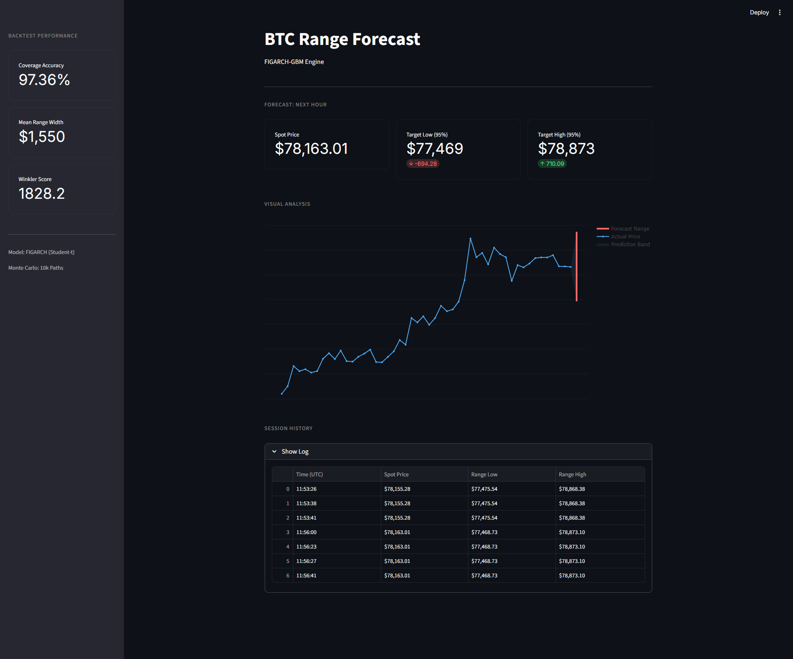
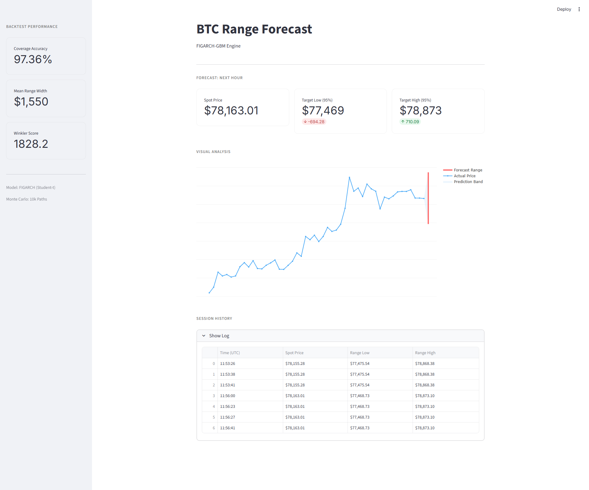

# BTC Range Forecast Dashboard

A professional quantitative analysis engine for predicting next-hour Bitcoin price ranges using FIGARCH volatility modeling and Monte Carlo simulations. Built for the AlphaI × Polaris Challenge.

## Dashboard Preview

| Light Mode | Dark Mode |
| :--- | :--- |
|  |  |

## Features
- **FIGARCH(1, d, 1) Engine**: Captures the long-memory volatility characteristic of Bitcoin.
- **Monte Carlo Simulation**: Runs 10,000 simulations per hour to generate a robust 95% confidence interval.
- **Student-t Distribution**: Accounts for "fat tails" and extreme market events.
- **Backtested Performance**: Verified over a 30-day (720-hour) window with 97%+ coverage.
- **Modern UI**: A theme-adaptive Streamlit dashboard with real-time forecasting.

## Project Structure
- `app.py`: Streamlit dashboard interface.
- `model.py`: Core forecasting logic (FIGARCH + GBM).
- `backtest.py`: 30-day validation engine.
- `data_utils.py`: Binance API client for real-time OHLCV data.
- `backtest_results.jsonl`: Historical results of the 720-hour validation run.

## Setup & Installation

### 1. Clone the repository
```bash
git clone https://github.com/Ayush-Patel-56/BTC-Analytics.git
cd BTC-Analytics
```

### 2. Install dependencies
```bash
pip install -r requirements.txt
```

### 3. Run the Dashboard
```bash
streamlit run app.py
```

### 4. Run Backtest (Optional)
To re-run the 30-day validation:
```bash
python backtest.py
```

## Methodology
The model utilizes a **Fractionally Integrated GARCH (FIGARCH)** model to estimate current conditional volatility. This volatility is then used as an input for a **Geometric Brownian Motion (GBM)** process. By simulating 10,000 potential price paths using a **Student-t distribution**, we determine the 2.5th and 97.5th percentiles to define a reliable 95% confidence range.
